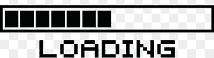

Hello, Welcome to my page. My name is Adam Pascoal. A Cybersecurity enthusiast with interest in Networking and Hardware.


### Proffesional Experience


<b>IT Support Analyst - H&M <br /> </b>   
<p style ="color:#ce4257"> Oct 24 </p>
>- to be filled yet

<b>Payroll Administrator - H&M  <br /></b>
<p style ="color:#ce4257">  Sep 23 - Oct 24 </p>
>-  Maintaining the Implementation and transistion of new Payroll system.<br />
>- Developed and Streamlined Payroll process using Advanced Excel functions and Forumlas increasing efficiency and accuracy.<br />
>- Processing Monthly End to End payroll including any statutory payments. <br />
>- Resolved Staff Queries <br />
>- Ensured Confidentitality of Employee pay records, maintaining strict data security.

<b>Payroll Administrator - Willow Pay Ltd <br /> </b> 
<p style ="color:#ce4257">  Jan 23 - Sep 24 </p>
>- Processing Clientele Payroll <br />
>- Amending time sheet and resolving Queries <br />
>- Maintaining Clientele relations <br />
>- Adhering to HMRC REgulations to Payroll Laws. 

### Projects



### Skills

|Languages  | Hard Skills   | Operating systems | 
|:-----------------|:----------------------|:------|
| Python   | Network Access Control| Windows  | 
| HTML     | Penetration Testing   | Kali Linux |
| #C       | Threat Detection      | Mac OS   |
| Arduino  | Incident Response     |          |
| SQL      | System Backup and Network Security

```
Thank you for taking a look 
```

<!--
#### Header 4

*   This is an unordered list following a header.
*   This is an unordered list following a header.
*   This is an unordered list following a header.

##### Header 5

1.  This is an ordered list following a header.
2.  This is an ordered list following a header.
3.  This is an ordered list following a header.

###### Header 6

| head1        | head two          | three |
|:-------------|:------------------|:------|
| ok           | good swedish fish | nice  |
| out of stock | good and plenty   | nice  |
| ok           | good `oreos`      | hmm   |
| ok           | good `zoute` drop | yumm  |

### There's a horizontal rule below this.

* * *

### Here is an unordered list:

*   Item foo
*   Item bar
*   Item baz
*   Item zip

### And an ordered list:

1.  Item one
1.  Item two
1.  Item three
1.  Item four

### And a nested list:

- level 1 item
  - level 2 item
  - level 2 item
    - level 3 item
    - level 3 item
- level 1 item
  - level 2 item
  - level 2 item
  - level 2 item
- level 1 item
  - level 2 item
  - level 2 item
- level 1 item

### Small image


### Large image


### Definition lists can be used with HTML syntax.

<dl>
<dt>Name</dt>
<dd>Godzilla</dd>
<dt>Born</dt>
<dd>1952</dd>
<dt>Birthplace</dt>
<dd>Japan</dd>
<dt>Color</dt>
<dd>Green</dd>
</dl>

```
Long, single-line code blocks should not wrap. They should horizontally scroll if they are too long. This line should be long enough to demonstrate this.
```
-->
